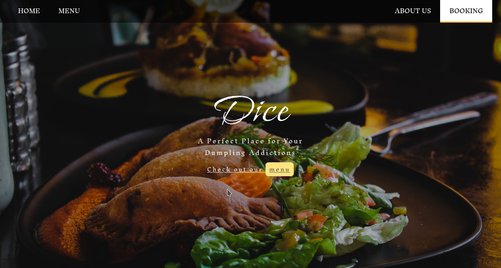

# Project: Restaurant Page

A simple restaurant page created using HTML, CSS and JavaScript with webpack.

Live demo [here](https://shiielty.github.io/restaurant-page/).

---

This is my first project using ES6 modules and webpack to bundle my modules.  
At first it was hard to understand how modules, node, and webpack work together. But as I'm working with the project, my understanding about those things become more clear and now I feel excited to use it more in my future project.